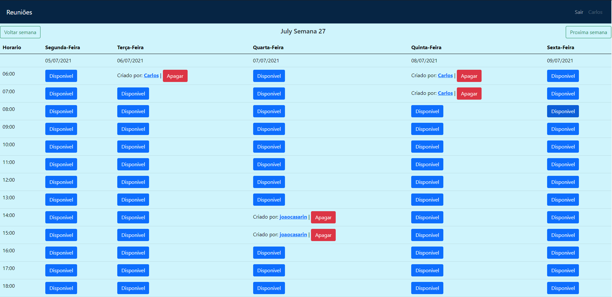

<h1 align="center">
    
</h1>

<br>

##Tecnologias

Esse projeto foi desenvolvido com as seguintes tecnologias:

- [Ruby on rails](https://guides.rubyonrails.org/)
- [Bootstrap](https://getbootstrap.com/)
- [postgree -Para hospedar no heroku](https://www.postgresql.org/)
- [sqlite -Para usar no localhost](https://sqlite.org/index.html)

#Hospedado pelo:
- [Heroku](https://www.heroku.com)

#URL para visualização:
- [Reuniao](https://reuniao.herokuapp.com/)


#Como executar

Clone o projeto e acesse a pasta do mesmo.

```bash
$ git clone https://github.com/CarlosBeraldo/Meeting-Room.git
```

Para iniciá-lo, siga os passos abaixo:
```bash
# Instalar as dependências
$ yarn

# Iniciar o projeto
$ rails s
```
O app estará disponível no seu browser pelo endereço http://localhost:3000.

##Projeto

Meeting-Room pode ser usado para controlar reservas de uma sala de reunião, onde é possivel criar salas com horário e data, verificar reuniões criadas, de uma forma muito organizada. 

Este é um projeto desenvolvido durante um teste de estágio, de um prazo de 7 dias de 29 de junho até 7 de julho de 2021.
